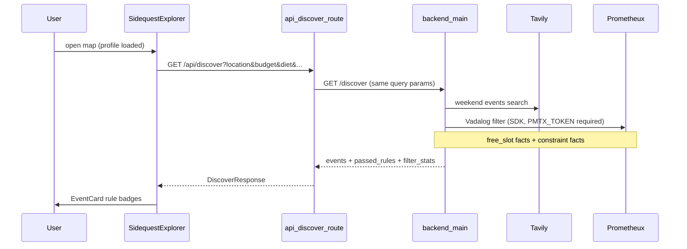
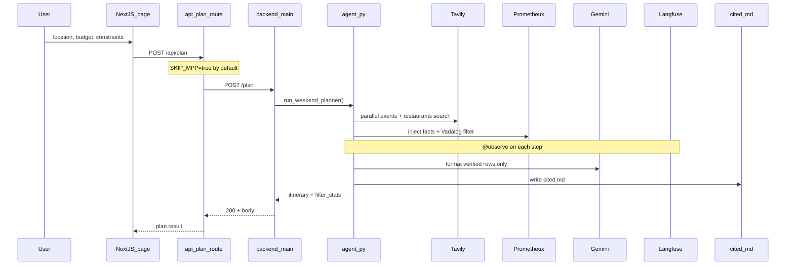

# Sidequest — Product Design Document

Hackathon submission for **Multiagents Hackathon (June 2026)**. **Sidequest — your weekend, verified.** Built for the **Prometheux track**: deterministic constraint filtering with Vadalog before any LLM formatting.

> **Cursor instruction:** Keep this file updated as features land. When adding endpoints, env vars, or pipeline steps, update the relevant sections here.

---

## Hackathon goal

Build a **deterministic autonomous agent** that plans a verified weekend itinerary from user constraints. The agent must:

1. Query **live web data** (Tavily) for events and restaurants.
2. Filter candidates **deterministically** with Prometheux / Vadalog — **the core differentiator** (no LLM in the filter gate).
3. Format a human-readable itinerary with **Gemini** using **only** Prometheux-verified rows.
4. Publish a **cited markdown table** to `cited.md` showing filter stats + verified candidates + itinerary.
5. Expose **Langfuse traces** for every tool, generation, and agent step.
6. *(Optional scaffold)* MPP micro-payments on the Next.js API route — **disabled by default** (`SKIP_MPP=true`).

### Acceptance criteria

| # | Criterion |
|---|-----------|
| 1 | User submits location, budget, diet, activities (+ optional accessibility) via Next.js form |
| 2 | Backend returns `{ itinerary, cited_path, trace_id, filter_stats }` — no wallet required when `SKIP_MPP=true` |
| 3 | `filter_stats` reports `candidates_in`, `candidates_out`, `filter_method: sdk` |
| 4 | `cited.md` shows Prometheux filter summary, verified candidate table, and itinerary with source URLs |
| 5 | Langfuse trace shows nested `agent` → `tool` / `generation` observations |
| 6 | Gemini never receives unfiltered Tavily candidates (Prometheux gate) |

---

## Prometheux / Vadalog ontology

### Input facts (from Tavily)

Each search result becomes a Vadalog fact:

```vadalog
candidate("evt_1", "event", "Jazz Fest", "https://...", 25, "Austin, TX", "outdoor,music", "Weekend jazz...").
candidate("rst_1", "restaurant", "Green Bowl", "https://...", 18, "Austin, TX", "vegan", "Plant-based...").
```

### Constraint facts (from user request)

```vadalog
max_budget(150).
target_location("austin").
has_diet_constraints.
required_diet_token("vegan").
has_activity_constraints.
required_activity_token("music").
has_access_constraints.
required_access_token("wheelchair").
```

### Rules (deterministic gate)

| Rule | Logic |
|------|-------|
| `budget_ok` | `Price =< max_budget` |
| `loc_ok` | `target_location` substring in `Loc` or `Title` |
| `diet_ok` | If diet constraints exist, at least one `required_diet_token` matches tags/title/snippet |
| `activity_ok` | If activity constraints exist, at least one `required_activity_token` matches |
| `access_ok` | If accessibility constraints exist, at least one `required_access_token` matches |
| `slot_ok` / `event_fits_slot` | If `free_slot` facts exist, event date/period text must overlap a user free slot |
| `matches` | All of the above must hold |

### Calendar free-slot facts

User calendar availability is injected as Vadalog facts (morning / afternoon / evening):

```vadalog
free_slot("saturday", "afternoon").
free_slot("sunday", "morning").
has_calendar_constraints.
```

`event_fits_slot/1` matches when the event `date_hint`, title, or snippet mentions the slot day (including `sat`/`sun`/`weekend` aliases) and, when a period is mentioned, the period (`morning`, `afternoon`, `evening`/`night`/`tonight`). If no period is mentioned, day-only match is sufficient.

Per-card `passed_rules` returned to the UI include tokens like `budget_ok`, `diet_match`, and `free_slot_saturday_afternoon`.

Output predicate: `@output("matches")`.

### SDK usage (`prometheux_chain`) — required

Prometheux is **SDK-only**. There is no REST or Python offline mirror — the backend fails with a clear error if the SDK or token is misconfigured.

```python
import prometheux_chain as px

px.config.set("PMTX_TOKEN", os.environ["PMTX_TOKEN"])
# Optional if SDK docs require it:
# px.config.set("JARVISPY_URL", "https://platform.prometheux.ai/jarvispy/{org}/{username}")
px.save_concept(project_id="weekend-planner", code=vadalog_program)
result = px.run_concept(project_id="weekend-planner", concept_name="matches")
```

#### Token setup

1. Sign up at [platform.prometheux.ai](https://platform.prometheux.ai).
2. Copy your API token into `PMTX_TOKEN` in `.env.local` (repo root) or `backend/.env`.
3. If the SDK requires it, set `JARVISPY_URL` to  
   `https://platform.prometheux.ai/jarvispy/{org}/{username}` (use your org and username from the platform).
4. Leave `PMTX_PROJECT_ID=weekend-planner` — the SDK creates/uses this namespace automatically; no manual project setup.

---

## Constraint schema

Request body for `POST /plan` (and frontend form):

| Field | Type | Required | Description |
|-------|------|----------|-------------|
| `location` | string | yes | City or area (e.g. `"Austin, TX"`) |
| `budget` | number | yes | Max spend per item / day (USD) |
| `diet` | string | yes | Dietary constraints (e.g. `"vegan, gluten-free"`) |
| `activities` | string | yes | Activity preferences (e.g. `"outdoor, music, museums"`) |
| `accessibility` | string | no | Accessibility needs (e.g. `"wheelchair accessible"`) |

### Normalized candidate schema (Tavily → Prometheux)

```json
{
  "id": "evt_1",
  "type": "event" | "restaurant",
  "title": "Jazz Fest",
  "url": "https://...",
  "snippet": "...",
  "price_estimate": 25,
  "location": "Austin",
  "tags": "outdoor,music"
}
```

---

## Data flow

### Discover (`GET /discover`) — Phase A



When `budget` is provided, discover runs the same Prometheux Vadalog gate as `/plan` (SDK-only). Optional query params: `diet`, `activities`, `accessibility`, `calendar_slots` (JSON array of `{date, period}`). Response includes `filter_stats: { candidates_in, candidates_out, filter_method: "sdk" }` and per-event `passed_rules`, `prometheux_verified`, `match_score`.

### Plan (`POST /plan`)



### Tool pipeline

1. **Tavily** — two parallel searches (weekend events + restaurants matching diet/budget).
2. **Fact injection** — Tavily JSON → Vadalog `candidate(...)` facts + constraint facts.
3. **Prometheux Vadalog** — deterministic `matches` predicate; only passing rows continue.
4. **Gemini** (`gemini-3.1-pro-preview`) — narrative / structured JSON from **verified rows only**.
5. **`cited.md`** — filter stats + verified candidates table + itinerary + Sources section.

---

## Prometheux track — judge demo script

1. Show form submit → UI displays `16 → 5` style filter stats with `filter_method: sdk`.
2. Open Langfuse trace: highlight `filter-with-prometheux` between Tavily and Gemini.
3. Open `cited.md`: point to **Verified candidates** section (Vadalog-passed rows).
4. Explain: changing budget/diet in the form changes which rows survive — **deterministic**, not prompt luck.
5. *(Optional)* Set `SKIP_MPP=false` to show MPP scaffold on `/api/plan`.

---

## Architecture

| Layer | Path | Technology |
|-------|------|------------|
| UI | `frontend/` | Next.js, TypeScript, Tailwind |
| API proxy | `frontend/app/api/plan/route.ts` | Direct proxy (MPP optional) |
| Agent API | `backend/main.py` | FastAPI on `:8000` |
| Orchestrator | `backend/agent.py` | Tavily + Prometheux + Gemini + Langfuse |
| Discover | `backend/discover.py` | Tavily search + Prometheux filter for map cards |
| Filter | `backend/prometheux_filter.py` | Vadalog via `prometheux_chain` |
| Output | `backend/format_output.py` | `cited.md` writer |

---

## Firebase setup

Firebase backs **Google Sign-In**, **Google Calendar read access** (free weekends / events), and **Firestore user profiles** for one-time onboarding.

| Item | Value |
|------|-------|
| Project ID | `perfect-weekend-planner` |
| Console | https://console.firebase.google.com/project/perfect-weekend-planner/overview |
| Web app | `perfect-weekend-planner-web` |
| App ID | `1:1078602360488:web:116bf6e78076cc582a449d` |
| Firestore region | `nam5` (default database) |

### Repo files

| Path | Purpose |
|------|---------|
| `firebase.json` | Firestore rules/indexes + Auth (Google provider, `localhost` authorized domain) |
| `.firebaserc` | Active project alias |
| `firestore.rules` | Users may read/write only `users/{uid}` where `uid == request.auth.uid` |
| `frontend/lib/firebase.ts` | App init from `NEXT_PUBLIC_FIREBASE_*` env vars |
| `frontend/lib/auth.ts` | Google sign-in popup + `calendar.readonly` OAuth scope |
| `frontend/lib/calendar.ts` | Google Calendar freeBusy → weekend morning/afternoon/evening slots |
| `frontend/lib/firestore.ts` | `UserProfile` save/load (`homeCity`, `budget`, `diet`, `activities`, `accessibility`) |
| `frontend/lib/profile.ts` | Profile store abstraction (Firestore or localStorage) |

### Authorized domains (Google Sign-In)

Local dev and hosting URLs must appear under **Authentication → Settings → Authorized domains**. As of 2026-06-26 the project lists:

- `localhost`
- `perfect-weekend-planner.firebaseapp.com`
- `perfect-weekend-planner.web.app`

Add App Hosting hostnames here after deploy (e.g. `weekend-explorer--perfect-weekend-planner.us-central1.hosted.app`).

**Verify** (requires `gcloud auth login` with access to the project):

```bash
curl -sS -H "Authorization: Bearer $(gcloud auth print-access-token)" \
  -H "X-Goog-User-Project: perfect-weekend-planner" \
  "https://identitytoolkit.googleapis.com/admin/v2/projects/perfect-weekend-planner/config" \
  | python3 -c "import sys,json; print(json.load(sys.stdin).get('authorizedDomains'))"
```

**Add a domain** (Firebase CLI has no `auth:settings` command; use Identity Toolkit Admin API):

```bash
curl -sS -X PATCH \
  -H "Authorization: Bearer $(gcloud auth print-access-token)" \
  -H "X-Goog-User-Project: perfect-weekend-planner" \
  -H "Content-Type: application/json" \
  "https://identitytoolkit.googleapis.com/admin/v2/projects/perfect-weekend-planner/config?updateMask=authorizedDomains" \
  -d '{"authorizedDomains":["localhost","perfect-weekend-planner.firebaseapp.com","perfect-weekend-planner.web.app","YOUR_HOST"]}'
```

Console: [Authentication → Settings → Authorized domains](https://console.firebase.google.com/project/perfect-weekend-planner/authentication/settings).

### Deploy / update Firebase backend

```bash
# From repo root (logged in via firebase login)
npx -y firebase-tools@latest deploy --only firestore
npx -y firebase-tools@latest deploy --only auth
```

### Frontend env

Copy `frontend/.env.local.example` → `frontend/.env.local` and fill `NEXT_PUBLIC_FIREBASE_*` from **Project settings → Your apps → Web app**. CLI one-liner:

```bash
npx -y firebase-tools@latest apps:sdkconfig WEB 1:1078602360488:web:116bf6e78076cc582a449d --project perfect-weekend-planner
```

Map SDK config keys to env vars: `apiKey` → `NEXT_PUBLIC_FIREBASE_API_KEY`, `authDomain` → `NEXT_PUBLIC_FIREBASE_AUTH_DOMAIN`, etc.

### Google Calendar scope

`frontend/lib/auth.ts` requests `https://www.googleapis.com/auth/calendar.readonly` on sign-in. The returned `accessToken` can call the Calendar API (client-side or forwarded to the Python backend). **Enable the Google Calendar API** in [Google Cloud Console](https://console.cloud.google.com/apis/library/calendar-json.googleapis.com?project=perfect-weekend-planner) for the same GCP project.

### User profile schema (`users/{uid}`)

| Field | Type | Notes |
|-------|------|-------|
| `uid` | string | Must match Auth UID / doc ID |
| `homeCity` | string | e.g. `"Austin, TX"` |
| `budget` | number | USD, > 0 |
| `diet` | string | Comma-separated preferences |
| `activities` | string | Comma-separated preferences |
| `accessibility` | string? | Optional |
| `onboardingCompleted` | boolean | Set `true` after onboarding |
| `createdAt` / `updatedAt` | timestamp | Server timestamps |

---

## Sidequest UI

Map-first Next.js app at `/` (`SidequestExplorer`). Leaflet + OpenStreetMap for pins; sidebar for event cards and detail.

| Component | Path | Role |
|-----------|------|------|
| `SidequestExplorer` | `frontend/components/SidequestExplorer.tsx` | Orchestrates auth, profile, calendar slots, discover, plan |
| `ExplorerMap` | `frontend/components/ExplorerMap.tsx` | Dynamic Leaflet map with event markers |
| `EventCard` | `frontend/components/EventCard.tsx` | Card with image, category, Prometheux rule badges |
| `EventDetail` | `frontend/components/EventDetail.tsx` | Selected event + Plan weekend CTA |
| `ProfileOnboarding` | `frontend/components/ProfileOnboarding.tsx` | One-time constraint capture modal |
| `PlanResultsPanel` | `frontend/components/PlanResultsPanel.tsx` | Itinerary overlay after `/api/plan` |

| Library | Path | Role |
|---------|------|------|
| `auth.ts` | `frontend/lib/auth.ts` | Firebase Google sign-in + `calendar.readonly` scope; stores OAuth token via `calendar.ts` |
| `calendar.ts` | `frontend/lib/calendar.ts` | Google Calendar `freeBusy` → `{ date, period }[]` for morning/afternoon/evening |
| `discover-client.ts` | `frontend/lib/discover-client.ts` | Builds discover query from profile + calendar slots |
| `profile.ts` | `frontend/lib/profile.ts` | Firestore profile store (localStorage fallback when Firebase unset) |
| `firestore.ts` | `frontend/lib/firestore.ts` | `users/{uid}` read/write |

**Discover request shape** (proxied by `frontend/app/api/discover/route.ts`):

```
GET /api/discover?location=Austin,%20TX&budget=150&diet=vegan&activities=music&accessibility=wheelchair&calendar_slots=[{"date":"saturday","period":"afternoon"}]
```

**Plan request shape** includes the same `calendar_slots` array in the JSON body.

When Prometheux SDK is unavailable, discover still returns events with locally computed `passed_rules` badges (no `filter_stats`); full SDK filter sets `prometheux_verified: true` and `filter_stats`.

---

## Environment variables

Copy root `.env.example` to `.env.local` (frontend keys) and `backend/.env` (Python keys).

| Variable | Service | Used by |
|----------|---------|---------|
| `SKIP_MPP` | — | Next.js API — `true` (default) skips MPP |
| `NEXT_PUBLIC_SKIP_MPP` | — | Browser client — mirrors server default |
| `MPP_SECRET_KEY` | MPP (optional) | Next.js API route when `SKIP_MPP=false` |
| `MPP_RECIPIENT` | MPP (optional) | Next.js API route |
| `MPP_CURRENCY` | MPP (optional) | Next.js API route |
| `BACKEND_URL` | — | Next.js → FastAPI (default `http://localhost:8000`) |
| `GEMINI_API_KEY` | Google AI | `agent.py` — itinerary generation |
| `TAVILY_API_KEY` | Tavily | `agent.py` — live search |
| `PMTX_TOKEN` | Prometheux | **Required** for `/plan` and filtered `/discover` — `prometheux_filter.py` SDK auth |
| `JARVISPY_URL` | Prometheux | Optional JarvisPy endpoint if SDK requires it |
| `PMTX_PROJECT_ID` | Prometheux | Project namespace (default `weekend-planner`) |
| `LANGFUSE_PUBLIC_KEY` | Langfuse | Auto-configured SDK |
| `LANGFUSE_SECRET_KEY` | Langfuse | Auto-configured SDK |
| `LANGFUSE_HOST` | Langfuse | Default `https://cloud.langfuse.com` |
| `NEXT_PUBLIC_FIREBASE_API_KEY` | Firebase | Web app config |
| `NEXT_PUBLIC_FIREBASE_AUTH_DOMAIN` | Firebase | Web app config |
| `NEXT_PUBLIC_FIREBASE_PROJECT_ID` | Firebase | `perfect-weekend-planner` |
| `NEXT_PUBLIC_FIREBASE_STORAGE_BUCKET` | Firebase | Web app config |
| `NEXT_PUBLIC_FIREBASE_MESSAGING_SENDER_ID` | Firebase | Web app config |
| `NEXT_PUBLIC_FIREBASE_APP_ID` | Firebase | Web app config |

**MPP:** Scaffolded only. `SKIP_MPP=true` is the default — no wallet for hackathon demo. Set `SKIP_MPP=false` + MPP keys to enable the payment gate.

---

## Local runbook

```bash
# Terminal 1 — backend
cd backend && python -m venv .venv && source .venv/bin/activate
pip install -r requirements.txt
uvicorn main:app --reload --port 8000

# Terminal 2 — frontend
cd frontend && npm install && npm run dev
```

Health check: `curl http://localhost:8000/health` → `{ "ok": true }`

---

## Risk mitigations

| Risk | Mitigation |
|------|------------|
| MPP wallet not configured | `SKIP_MPP=true` default; route proxies directly to backend |
| Prometheux latency / SDK issues | Clear HTTP 502/503 errors with setup hints; no offline mirror |
| Gemini invents venues | Prometheux filter is gate; prompt forbids invented venues |
| Wrong `cited.md` path | `Path(__file__).resolve().parent.parent / "cited.md"` |
| Langfuse SDK drift | `from langfuse import observe, propagate_attributes` |
